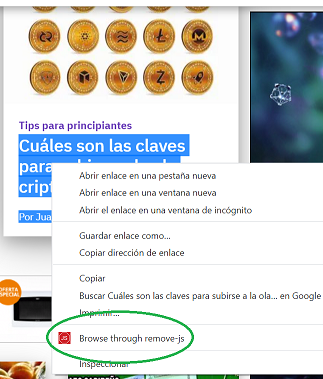

Esta extensión te permite navegar un link a través de remove-js.com, es útil para algunos sitios de noticias que no te permiten leer la noticia completa sin registrarte.

Con la extensión va a aparecer la opción en el menú al dar click derecho en un link, al seleccionar la opción se abrirá una pestaña con la página, pero con una versión sin Javascript.

